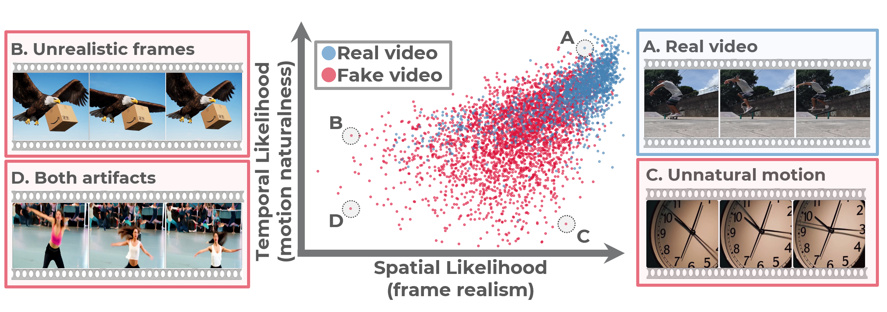

<div align="center">

# Training-free Detection of Generated Videos<br>via Spatial-Temporal Likelihoods

**CVPR 2026**

[](https://arxiv.org/abs/2603.15026) [](https://omerbenhayun.github.io/stall-video/) [](https://huggingface.co/datasets/OmerXYZ/comgenvid) [](#citation)
<!-- []() -->
<!-- []() -->



<br>

**[Omer Ben Hayun](https://github.com/OmerBenHayun)** ·
**[Roy Betser](https://www.linkedin.com/in/roy-betser/)** ·
**[Meir Yossef Levi](https://www.linkedin.com/in/yossi-levi-a3755a190/)** ·
**[Levi Kassel](https://www.linkedin.com/in/levi-kassel-06a478178)** ·
**[Guy Gilboa](https://guygilboa.net.technion.ac.il/)**

Technion - Israel Institute of Technology

</div>

This is the official implementation of **"Training-free Detection of Generated Videos via Spatial-Temporal Likelihoods"** (CVPR 2026).

<!--
---

## 📰 News

- **[Apr 2026]** Code released.
- **[Feb 2026]** Paper accepted to CVPR 2026.

---
-->

## 🔍 Overview

**STALL** detects AI-generated videos in a **training-free, zero-shot** manner by measuring how anomalous a video's spatial and temporal statistics are relative to a calibration set of real videos.

Given a video, STALL extracts per-frame embeddings using **DINOv3 ViT-L/16** and computes log-likelihoods along two branches:
- **Spatial branch**: measures how unusual the raw frame appearance is
- **Temporal branch**: measures how unusual the frame-to-frame motion is

Each branch score is converted to a percentile against a [VATEX](https://arxiv.org/abs/1904.03493) calibration set (the whitening transform and calibration scores, both computed from VATEX, are provided in `precomputed/stall_params_vatex_dino_v3.npz`). The final score is their average.

**Higher score = more likely real.** No training, fine-tuning, or labeled fake videos required.

---

## ⚙️ Installation

### 1. Clone the repo

```bash
git clone https://github.com/OmerBenHayun/STALL.git
cd STALL
```

### 2. Create the environment

```bash
# micromamba
micromamba env create -f environment.yml
micromamba activate stall

# conda
conda env create -f environment.yml
conda activate stall
```

### 3. Install PyTorch

Install PyTorch for your hardware. The commands below are examples; visit [pytorch.org](https://pytorch.org/get-started/locally/) to get the exact command for your CUDA version:

```bash
# GPU (example: CUDA 12.4)
pip install torch torchvision --index-url https://download.pytorch.org/whl/cu124

# CPU-only
pip install torch torchvision
```

### 4. Set up DINOv3

> **Skip this step** if you only plan to use the `--hf-dataset OmerXYZ/comgenvid` path (it uses pre-computed embeddings and does not require DINOv3).

**Clone the repo** into the project directory (gitignored):

```bash
git clone https://github.com/facebookresearch/dinov3 dinov3
mkdir -p dinov3/weights
```

**[Download the weights](https://ai.meta.com/resources/models-and-libraries/dinov3-downloads/)** (model: `ViT-L/16 distilled`, pretraining dataset: `LVD-1689M`, filename: `dinov3_vitl16_pretrain_lvd1689m-8aa4cbdd.pth`) and place the file at:

```
dinov3/weights/dinov3_vitl16_pretrain_lvd1689m-8aa4cbdd.pth
```

To use DINOv3 from a different location, override the defaults with env vars:

```bash
export DINO_V3_REPO_DIR=/path/to/dinov3
export DINO_V3_WEIGHTS=/path/to/dinov3/weights/dinov3_vitl16_pretrain_lvd1689m-8aa4cbdd.pth
```

---

## 🚀 Usage

This implementation supports three input modes.

### Mode 1: HuggingFace dataset (comgenvid only, fastest, no DINOv3 required)

Downloads pre-computed embeddings for the **comgenvid** benchmark directly from HuggingFace. No video files, no DINOv3, no GPU needed.

```bash
python src/eval.py --hf-dataset OmerXYZ/comgenvid
```

<details>
<summary>Expected output</summary>

```
Loading HuggingFace dataset: OmerXYZ/comgenvid
Downloading embeddings.parquet…
Loading embeddings into memory…
  Warning: 2 videos missing '2_sec_idxs' (too short for the requested window, skipped). Pass --debug for details.
Loaded 5098 videos. Starting scoring…
Scoring: 100%|██████████████████��███████████████| 5098/5098 [01:19<00:00, 64.50video/s]

============================================================
                          RESULTS
============================================================
| Generative Model   |  #real  |  #fake  |  AP   |  AUC  |
|--------------------|---------|---------|-------|-------|
| Sora               |  1698   |  1698   | 0.846 | 0.840 |
| VEO3               |  1698   |  1698   | 0.870 | 0.865 |
| Average            |  1698   |  1698   | 0.858 | 0.852 |
============================================================
```

> **Note on the Warning:** 2 real videos in the comgenvid dataset are slightly shorter than 2 seconds, so their `2_sec_idxs` field is absent. These videos are skipped. The effect on scores is negligible (2 out of 5100).

</details>

### Mode 2: Local video directories

Walks two directory trees of `.mp4` files and extracts DINOv3 embeddings on-the-fly. Each subdirectory is treated as one source (real dataset or AI generator). The subdirectory name is used as the label in the results table.

```bash
python src/eval.py --real-dir path/to/real/ --fake-dir path/to/fake/
```

> **Note:** This mode loads all frames from each video at its native fps and length. This differs from the paper setup, which uses 8 fps downsampled to a fixed 2-second window. For exact paper-style scoring, use Mode 3.

<details>
<summary>Example with the included demo dataset</summary>

```bash
python src/eval.py --real-dir datasets/demo_dataset/real/ \
                   --fake-dir datasets/demo_dataset/fake/
```

The demo dataset structure:
```
real/
├── MSVD/          ← real video dataset
│   ├── clip1.mp4
│   └── clip2.mp4
└── MSR-VTT/       ← another real video dataset
    └── clip3.mp4
fake/
├── Sora/          ← AI generator
│   └── clip4.mp4
└── VEO3/          ← AI generator
    └── clip5.mp4
```

</details>

### Mode 3: CSV with embedding cache (recommended for large datasets)

Recommended for large benchmarks and for reproducing paper results. A two-step pipeline:

**Step 1:** Build an index CSV with `video_index.py`. This scans your video directories, reads each video's metadata (fps, duration, frame count), and pre-computes which frame indices to extract at 8 fps and for each duration window (1–4 s). The result is saved as a CSV.

**Step 2:** Run `eval.py` with `--csv` and `--emb-cache`. On the first run, DINOv3 embeddings are extracted for the pre-selected frames and cached to disk. On subsequent runs, cached embeddings are loaded directly (no DINOv3 re-run needed). You can re-score with a different `--duration` without re-extracting.

The script auto-detects whether a CSV is enriched by checking for the presence of a `2_sec_idxs` column (or whichever `--duration` was selected). If the column is present, the cache path is used automatically; you do not need to pass `--emb-cache` explicitly, though providing it is recommended to control where embeddings are stored.

```bash
# Step 1: build index
mkdir -p cache/indexes cache/embeddings/demo results
python src/video_index.py --real-dir datasets/demo_dataset/real/ \
                          --fake-dir datasets/demo_dataset/fake/ \
                          --output cache/indexes/demo.csv

# Step 2: extract + score (first run extracts; subsequent runs load from cache)
python src/eval.py --csv cache/indexes/demo.csv \
                   --emb-cache cache/embeddings/demo/ \
                   --max-seconds 2 \
                   --output-csv results/demo_results.csv
```

### Demo notebook (interactive)

`notebooks/demo.ipynb` is a self-contained walkthrough covering:

- **Single-video inference**: load a video, run STALL, and print the spatial/temporal/final scores
- **Batch scoring**: score all videos in a directory and collect results into a DataFrame
- **Results table**: AUC/AP per generator, matching the paper's output format
- **Score distribution plot**: histogram of real vs. fake scores to visualize separability

**One-time kernel setup** (run once after creating the environment):

```bash
pip install jupyter ipykernel
python -m ipykernel install --user --name stall --display-name "Python (stall)"
```

Then open the notebook:

```bash
jupyter notebook notebooks/demo.ipynb
```

Once the notebook is open, select the correct kernel via **Kernel > Change kernel > Python (stall)**.

### CLI reference

<details>
<summary><code>src/video_index.py</code>: scans raw video directories and writes an enriched index CSV with pre-computed frame indices (input to <code>eval.py</code>).</summary>

| Flag | Default | Description |
|---|---|---|
| `--real-dir DIR` | | Directory of real videos: `<model>/*.mp4` subdirs |
| `--fake-dir DIR` | | Directory of fake videos: `<model>/*.mp4` subdirs |
| `--output CSV` | | Output CSV path |
| `--target-fps FPS` | `8` | Target frame rate for downsampling |
| `--workers N` | `8` | Parallel ffprobe workers |
| `--debug [N]` | | Keep at most N videos per source (fast test) |

</details>

<details>
<summary><code>src/eval.py</code>: runs STALL on a dataset and prints AUC/AP results per generator.</summary>

| Flag | Default | Description |
|---|---|---|
| `--hf-dataset REPO_ID` | | HuggingFace repo with pre-computed embeddings (comgenvid only) |
| `--csv CSV_PATH` | | CSV with columns: `video_path`, `subset`, `source_model` |
| `--real-dir DIR` / `--fake-dir DIR` | | Local video directories (`<model>/*.mp4` subdirs) |
| `--emb-cache PATH` | | Embedding cache directory (used with enriched CSV from `video_index.py`) |
| `--output-csv PATH` | | Save per-video scores to CSV |
| `--duration {1,2,3,4}` | `2` | Second-window to score (Mode 3 / HF only) |
| `--compact` | | Extract only the `--duration`-second window frames instead of the full video. Saves a compact cache (`{stem}_{duration}s.pt`). Speeds up extraction for long videos. Cannot switch `--duration` later without re-extracting. (Mode 3 only) |
| `--workers N` | `4` | CPU decode threads for parallel video loading |
| `--video-batch N` | `8` | Videos batched together for a single GPU pass |
| `--params PATH` | `precomputed/stall_params_vatex_dino_v3.npz` | STALL params file |
| `--dino-repo PATH` | `dinov3/` | Override DINOv3 repo path |
| `--dino-weights PATH` | `dinov3/weights/dinov3_vitl16_pretrain_lvd1689m-8aa4cbdd.pth` | Override DINOv3 weights path |
| `--debug [N]` | | Print per-step scores for one real and one fake sample. Pass N to also limit to N videos per source. |
| `--split SPLIT` | `train` | HuggingFace dataset split (no need to change) |

</details>

---

## 📊 Reproducing Paper Results

We provide scripts to reproduce the three main benchmark results from the paper: VideoFeedback, GenVideo, and ComGenVid.

### VideoFeedback (11 generators + DiDeMo + Panda70M)

**Step 1: Download and organize the dataset**

See [`docs/download_videofeedback.md`](docs/download_videofeedback.md) for full instructions. After downloading and organizing, your directory should look like:

```
datasets/videofeedback/
├── real/
│   ├── DiDeMo/            *.mp4
│   └── Panda70M/          *.mp4
└── fake/
    ├── AnimateDiff/        *.mp4
    ├── Fast-SVD/           *.mp4
    ├── Hotshot-XL/         *.mp4
    ├── LaVie-base/         *.mp4
    ├── LVDM/               *.mp4
    ├── ModelScope/         *.mp4
    ├── Pika/               *.mp4
    ├── SoRA-Clip/          *.mp4
    ├── Text2Video-Zero/    *.mp4
    ├── VideoCrafter2/      *.mp4
    └── ZeroScope-576w/     *.mp4
```

**Step 2: Build the index**

```bash
mkdir -p cache/indexes
python src/video_index.py --real-dir datasets/videofeedback/real/ \
                          --fake-dir datasets/videofeedback/fake/ \
                          --output cache/indexes/videofeedback.csv
```

**Step 3: Score**

```bash
mkdir -p cache/embeddings/videofeedback results
python src/eval.py --csv cache/indexes/videofeedback.csv \
                   --emb-cache cache/embeddings/videofeedback/ \
                   --output-csv results/videofeedback_results.csv \
                   --workers 8 --video-batch 8
```

The first run extracts DINOv3 embeddings and caches them to disk (GPU recommended). Subsequent runs load from cache and are fast.

> **Note on multiple real sources:** VideoFeedback has two real sources (DiDeMo and Panda70M). For each fake generator's pairwise comparison, the eval script samples an equal number of real videos from each real source (equal quota per source), keeping the total at or below the fake count. The output is always evenly distributed across real sources.

> **Note on dynamic-degree filtering:** In the original VideoFeedback paper, each clip is assigned a dynamic-degree score (1-4) indicating how much motion it contains. Our paper retains only the highest-scoring clips (levels 3-4); see Table 7 in our supplementary for the full benchmark statistics. This code uses all videos regardless of dynamic-degree score. We did not find this to matter much in practice, but results may differ slightly from those reported in the paper.

> **Note on Hotshot-XL:** Hotshot-XL generates 1-second videos. In the paper, these are scored against real 1-second clips at 8 FPS (8 frames). To reproduce those results, score Hotshot-XL separately with `--duration 1`:
> ```bash
> python src/eval.py --csv cache/indexes/videofeedback.csv \
>                    --emb-cache cache/embeddings/videofeedback/ \
>                    --output-csv results/videofeedback_hotshot_results.csv \
>                    --duration 1
> ```
> The default `--duration 2` run above will skip Hotshot-XL videos (they lack a `2_sec_idxs` field), so the table above covers the remaining 10 generators only.

---

### GenVideo (10 generators + MSR-VTT)

**Step 1: Download the dataset**

See [`docs/download_genvideo.md`](docs/download_genvideo.md) for full instructions. After downloading, your directory should look like:

```
datasets/genvideo/
├── real/
│   └── MSR-VTT/       *.mp4
└── fake/
    ├── Crafter/        *.mp4
    ├── Gen2/           *.mp4
    ├── HotShot/        *.mp4
    ├── Lavie/          *.mp4
    ├── ModelScope/     *.mp4
    ├── MoonValley/     *.mp4
    ├── MorphStudio/    *.mp4
    ├── Show_1/         *.mp4
    ├── Sora/           *.mp4
    └── WildScrape/     *.mp4
```

**Step 2: Build the index**

```bash
mkdir -p cache/indexes
python src/video_index.py --real-dir datasets/genvideo/real/ \
                          --fake-dir datasets/genvideo/fake/ \
                          --output cache/indexes/genvideo.csv
```

**Step 3: Score**

```bash
mkdir -p cache/embeddings/genvideo results
python src/eval.py --csv cache/indexes/genvideo.csv \
                   --emb-cache cache/embeddings/genvideo/ \
                   --output-csv results/genvideo_results.csv \
                   --workers 8 --video-batch 8
```

> **Note on HotShot and MoonValley:** These two generators produce 1-second videos. In the paper, they are scored against real 1-second clips at 8 FPS (8 frames). To reproduce those results, score them separately with `--duration 1`:
> ```bash
> python src/eval.py --csv cache/indexes/genvideo.csv \
>                    --emb-cache cache/embeddings/genvideo/ \
>                    --output-csv results/genvideo_1s_results.csv \
>                    --duration 1
> ```
> The default `--duration 2` run above will skip HotShot and MoonValley videos (they lack a `2_sec_idxs` field), so the table above covers the remaining 8 generators only.

---

### comgenvid (Sora + VEO3)

**Option A: HuggingFace embeddings (no setup required)**

Pre-computed embeddings are downloaded automatically from HuggingFace. No video files or DINOv3 needed.

```bash
python src/eval.py --hf-dataset OmerXYZ/comgenvid
```

**Option B: Local videos (same flow as the rest of the benchmarks)**

See [`docs/download_comgenvid.md`](docs/download_comgenvid.md) for download instructions. After downloading, your directory should look like:

```
datasets/comgenvid/
├── real/
│   └── MSVD/          *.mp4
└── fake/
    ├── Sora/           *.mp4
    └── VEO3/           *.mp4
```

Then build the index and score (same flow as GenVideo above):

```bash
mkdir -p cache/indexes cache/embeddings/comgenvid results
python src/video_index.py --real-dir datasets/comgenvid/real/ \
                          --fake-dir datasets/comgenvid/fake/ \
                          --output cache/indexes/comgenvid.csv
python src/eval.py --csv cache/indexes/comgenvid.csv \
                   --emb-cache cache/embeddings/comgenvid/ \
                   --compact \
                   --output-csv results/comgenvid_results.csv \
                   --workers 8 --video-batch 8
```

> **Tip:** `--compact` limits extraction to only the `--duration`-second window (16 frames per video at the default `--duration 2`) instead of the full video at 8 fps. This is much faster for long real videos (e.g. the MSVD real videos in comgenvid). The compact cache is saved as `{stem}_{duration}s.pt` and reused on subsequent runs. Trade-off: if you later want to re-score with a different `--duration`, you need to re-extract (omit `--compact` to build a full cache instead).

---

## 🔧 Using a Custom Calibration Set

STALL requires a **calibration set** of real videos to fit its whitening statistics and score distributions. In the paper we use [VATEX](https://arxiv.org/abs/1904.03493) (~33k real videos), which is **completely disjoint** from all evaluation benchmarks (VideoFeedback, GenVideo, ComGenVid), ensuring no overlap or leakage. Only real videos are used; no generated content is involved at any stage.

To calibrate on your own real videos, use `src/create_params.py`. It fits the whitening transform (spatially on one random frame per video, temporally on all frame-to-frame transitions) and records the calibration log-likelihood distributions. The output `.npz` is a drop-in replacement for `precomputed/stall_params_vatex_dino_v3.npz`.

**Option 1: HuggingFace dataset (no DINOv3 needed)**

Use the real videos from [comgenvid](https://huggingface.co/datasets/OmerXYZ/comgenvid) via pre-computed embeddings (no video download or GPU required):

```bash
python src/create_params.py \
    --hf-dataset OmerXYZ/comgenvid \
    --output precomputed/my_params.npz
```

**Option 2: Local real video directory (requires DINOv3)**

Point to any directory of real `.mp4` files (searched recursively):

```bash
python src/create_params.py \
    --real-dir /path/to/real/videos/ \
    --output precomputed/my_params.npz
```

Then evaluate with the new params:

```bash
python src/eval.py --hf-dataset OmerXYZ/comgenvid --params precomputed/my_params.npz
```

<details>
<summary><code>src/create_params.py</code> CLI reference</summary>

| Flag | Default | Description |
|---|---|---|
| `--hf-dataset REPO_ID` | | HuggingFace dataset with pre-computed embeddings; real videos are filtered automatically |
| `--real-dir DIR` | | Directory of real `.mp4` files (searched recursively). Requires DINOv3. |
| `--output PATH` | | Output `.npz` path |
| `--duration {1,2,3,4}` | `2` | Frame window in seconds (default matches paper: 2 s at 8 fps = 16 frames) |
| `--split SPLIT` | `train` | HuggingFace dataset split |
| `--dino-repo PATH` | `dinov3/` | Override DINOv3 repo path (`--real-dir` mode only) |
| `--dino-weights PATH` | `dinov3/weights/...pth` | Override DINOv3 weights path (`--real-dir` mode only) |

</details>

---

<a name="citation"></a>

## 📄 Citation

If you find this work useful in your research, please consider citing us:

```bibtex
@inproceedings{hayun2026trainingfreedetectiongeneratedvideos,
  title     = {Training-free Detection of Generated Videos via Spatial-Temporal Likelihoods},
  author    = {{Ben Hayun}, Omer and Betser, Roy and Levi, Meir Yossef and Kassel, Levi and Gilboa, Guy},
  booktitle = {Proceedings of the IEEE/CVF Conference on Computer Vision and Pattern Recognition},
  year      = {2026},
  eprint    = {2603.15026},
  archivePrefix = {arXiv},
  primaryClass  = {cs.CV},
  url       = {https://arxiv.org/abs/2603.15026},
}
```
