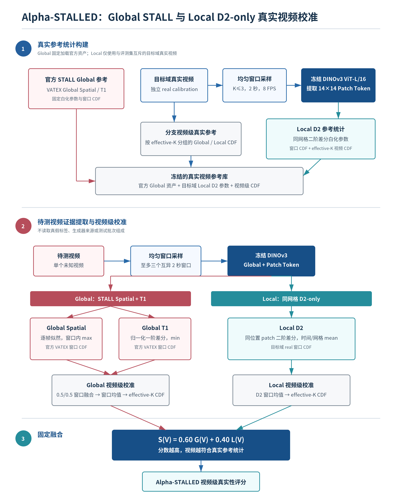

# Alpha-STALLED 最新方法与实验说明

本文档对应当前正式方法 `Global STALL + Local D2-only + K=3`。旧版中的 Local Spatial、`0.1 Spatial + 0.9 D2`、region pooling、K5/all-window、旧 locked U0 和 45,185 fake 扩展结果不再作为正式方法证据。

## 一、方法概览



Alpha-STALLED 包含真实参考统计构建、待测视频证据提取与视频级校准、固定融合三个阶段，可细分为以下五个步骤。

### 1. 真实视频参考统计构建

Global 与 Local 使用不同层级的真实参考：

- **Global 分支**固定加载原版 STALL 发布的 VATEX Global Spatial 与 Global T1 白化参数和窗口级经验分布，不在目标评测数据上重新拟合。
- **Local 分支**仅使用与 evaluation 严格互斥的目标域真实视频。每个真实视频在 8 FPS 下均匀选取至多三个 2 秒窗口，每窗包含 16 帧。冻结 DINOv3 ViT-L/16 输出 `14×14×1024` patch token 网格，据此拟合同网格二阶差分的白化参数与窗口 CDF。
- Global 与 Local 分支还分别使用目标域真实校准视频建立按 effective-K 分组的视频级经验 CDF，保证 K=1、K=2、K=3 的视频不会共享不匹配的分数分布。

所有参数均只由真实视频或官方 VATEX 资产构建；生成视频不参与白化、CDF、阈值或融合权重拟合。

### 2. 待测视频特征提取

待测视频采用与校准阶段相同的 8 FPS 和均匀窗口策略。每个窗口经同一冻结 DINOv3 前向传播，同时获得：

- 帧级 Global token 序列；
- `14×14` Patch token 时空网格。

该过程不需要视频真假标签、生成器来源或测试批次类别比例，也不更新编码器参数。

### 3. Global 真实性证据

Global 分支严格继承 STALL：

1. **Global Spatial**：计算每帧 Global token 的真实似然，并在窗口内取最大值。
2. **Global T1**：计算相邻 Global token 的归一化一阶差分，评估整体运动变化是否符合真实参考，并在窗口内取最小似然。
3. 两个统计分别映射到官方 VATEX 窗口 CDF，并等权融合：

```text
Global Window Score = 0.5 × Global Spatial + 0.5 × Global T1
```

多个窗口的 Global Window Score 取均值后，再映射到目标域 effective-K 匹配的真实视频 CDF，得到视频级 `Global Score`。

### 4. Local D2 真实性证据

最终 Local 分支**不包含 Local Spatial**。对连续三帧同一 patch 网格位置的特征计算二阶差分：

```text
a[t,i] = p[t+2,i] - 2p[t+1,i] + p[t,i]
```

二阶差分沿特征维 L2 归一化后，以目标域真实视频拟合的白化模型计算似然。窗口内对全部时间位置与 `14×14` 网格位置取算术均值，再映射到真实窗口 CDF，得到 `Local D2 Window Score`。

多个窗口的 Local D2 Window Score 取均值，并按 effective-K 使用目标域真实视频重新校准，得到视频级 `Local Score`。

Local Spatial 被删除的原因是：Spatial-only 明显弱于 D2-only，并且把 Spatial 加入 Local 或完整模型都会显著降低 Macro 指标。

### 5. Global 与 Local 固定融合

最终视频真实性分数为：

```text
Final Score = 0.60 × Global Score + 0.40 × Local D2 Score
```

分数越高，表示视频越符合真实视频的全局外观、整体运动和局部二阶轨迹统计。该分数是相对真实参考库的典型性，不应解释为经过概率校准的法律真实性结论。

## 二、开发集评测协议

| Dataset | Evaluation real | Evaluation fake | Fake generators | Calibration real |
|---|---:|---:|---:|---:|
| ComGenVid | 898 | 3,400 | 2 | 200 |
| VideoFeedback | 500 | 3,000 | 10 | 200 |
| GenVideo | 7,984 | 5,639 | 8 | 200 |
| **Total** | **9,382** | **12,039** | **20** | **600** |

每个生成器与确定性选择的等量真实视频计算 AUC 和 real-positive AP；先在数据集内对生成器等权平均，再对三个数据集等权平均得到 Macro-3。所有跨 run 对照按 `video_id` 对齐并使用同一配对身份计算 paired bootstrap。

## 三、主结果

### 1. 最终方法结果

| Dataset | AUC | Real-positive AP |
|---|---:|---:|
| ComGenVid | 0.9015 | 0.9110 |
| VideoFeedback | 0.8621 | 0.8687 |
| GenVideo | 0.8586 | 0.8391 |
| **Macro-3** | **0.8741** | **0.8729** |

正式结果来自：

- `results/runs/alpha_stall_full_d2_k3_no_spatial_refit/video_scores.csv`
- `results/runs/alpha_stall_full_d2_k3_no_spatial_refit/pairwise_metrics.csv`

### 2. 公开 training-free 方法参考范围

下表中的公开基线来自对应论文，不保证与 Alpha-STALLED 使用完全相同的视频交集和预处理，因此只能作为参考范围，不能替代同 manifest 官方代码重跑。

| Method | VideoFeedback | GenVideo | ComGenVid | Macro-3 |
|---|---:|---:|---:|---:|
| AEROBLADE (published) | 0.58/0.58 | 0.59/0.61 | 0.69/0.64 | 0.62/0.61 |
| RIGID (published) | 0.63/0.62 | 0.65/0.63 | 0.57/0.59 | 0.61/0.59 |
| ZED (published) | 0.54/0.54 | 0.55/0.57 | 0.55/0.57 | 0.57/0.58 |
| D3-L2 (published) | 0.54/0.57 | 0.72/0.74 | 0.73/0.71 | 0.64/0.65 |
| D3-cos (published) | 0.55/0.57 | 0.70/0.74 | 0.73/0.71 | 0.64/0.65 |
| STALL (published) | 0.83/0.85 | 0.80/0.80 | 0.85/0.86 | 0.82/0.82 |
| **Alpha-STALLED D2-only K3** | **0.8621/0.8687** | **0.8586/0.8391** | **0.9015/0.9110** | **0.8741/0.8729** |

## 四、核心消融

### 1. Global 与 Local D2 组件消融

| Method | ComGenVid | VideoFeedback | GenVideo | Macro-3 |
|---|---:|---:|---:|---:|
| Global-only K3 | 0.8668/0.8762 | 0.8580/0.8694 | 0.8320/0.8140 | 0.8523/0.8532 |
| Local D2-only K3 | 0.8995/0.8970 | 0.7368/0.7539 | 0.8447/0.8179 | 0.8270/0.8229 |
| **Global + Local D2 K3** | **0.9015/0.9110** | **0.8621/0.8687** | **0.8586/0.8391** | **0.8741/0.8729** |

最终方法相对 Global-only 提高 `+0.0218 AUC / +0.0197 AP`，AUC 的 95% CI 为 `[0.0191, 0.0242]`。Global 与 Local D2 的相对作用具有数据集差异：ComGenVid 的 Local D2 很强，而 VideoFeedback 明显依赖 Global。

### 2. Local D1 与 D2

| Variant | ComGenVid | VideoFeedback | GenVideo | Macro-3 |
|---|---:|---:|---:|---:|
| Local D1-only | 0.8883/0.8856 | 0.7309/0.7412 | 0.8334/0.8043 | 0.8176/0.8103 |
| Local D2-only | 0.8995/0.8970 | 0.7368/0.7539 | 0.8447/0.8179 | 0.8270/0.8229 |
| Full D1, no Spatial | 0.9003/0.9095 | 0.8591/0.8650 | 0.8561/0.8346 | 0.8719/0.8697 |
| **Full D2, no Spatial** | **0.9015/0.9110** | **0.8621/0.8687** | **0.8586/0.8391** | **0.8741/0.8729** |

- Local D2 相对 Local D1：`+0.0094 AUC / +0.0126 AP`。
- Full D2 相对 Full D1：`+0.0022 AUC / +0.0033 AP`。
- Full AUC 增益 95% CI：`[0.0015, 0.0028]`。

D2 在三个开发数据集上的方向一致，说明性能提升与局部二阶轨迹本身相关，而不是简单增加 patch 分支。

### 3. K1 与 K3 时间覆盖

| Coverage | ComGenVid | VideoFeedback | GenVideo | Macro-3 | Relative frames |
|---|---:|---:|---:|---:|---:|
| K=1 | 0.8968/0.9043 | **0.8633/0.8716** | 0.8441/0.8358 | 0.8681/0.8706 | 1.00× |
| K=3 | **0.9015/0.9110** | 0.8621/0.8687 | **0.8586/0.8391** | **0.8741/0.8729** | 2.30× |

K3 相对 K1 的 Macro 增益为 `+0.0060 AUC / +0.0024 AP`，AUC 95% CI 为 `[0.0033, 0.0087]`。收益主要来自 ComGenVid 和 GenVideo；VideoFeedback 没有提升。因此 K3 是开发集宏平均上的固定选择，不是对每个数据域都成立的普遍结论。

旧 K5 与 all-window 数据来自不同方法定义，不再进入当前严格 K1/K3 表。

### 4. Local Spatial rejection

| Variant | Macro-3 AUC | Macro-3 AP |
|---|---:|---:|
| Local Spatial-only | 0.6848 | 0.6945 |
| **Local D2-only** | **0.8270** | **0.8229** |
| Local Spatial + D2 | 0.8195 | 0.8172 |
| Full Spatial + D2 | 0.8726 | 0.8717 |
| **Full D2-only** | **0.8741** | **0.8729** |

把 Spatial 加入 Local D2 后，Macro AUC/AP 下降 `0.0075/0.0057`；加入完整模型后下降 `0.0015/0.0012`，AUC 95% CI 为 `[-0.0019, -0.0011]`。因此 Local Spatial、region pooling 和 Patch Spatial 分数已从正式方法中删除。

## 五、GenVidBench Pair1 外部验证

外部协议使用 199 条 VRiPT real calibration，evaluation 包含 300 条 VRiPT real 与 300 条 ModelScope fake。

| Method | AUC | Real AP | Fake AP |
|---|---:|---:|---:|
| Global-only K3 | 0.8137 | 0.8358 | 0.7733 |
| D2-only K1 | **0.8391** | **0.8440** | 0.8015 |
| D2-only K3 | 0.8386 | 0.8430 | **0.8058** |

- K3 Final 相对 Global-only：AUC `+0.0249`，95% CI `[0.0073, 0.0404]`。
- K3 相对 K1：AUC/AP `-0.0005/-0.0011`，两个 CI 均跨零。

因此 GenVidBench 支持 Local D2 的外部域贡献，但不支持 K3 在该外部集优于 K1。由于 ModelScope 也存在于开发数据，GenVidBench 应称为外部数据域验证，而不是严格未见生成器验证。

## 六、当前证据边界

以下旧结果尚未在最终无 Spatial 方法下重跑，因此不进入当前正式结论：

- region=1/2/3 与 bottom-k 敏感性；
- K=5 与 all-window；
- 三个独立 200-real reserve split 与旧校准规模曲线；
- 45,185 fake 全覆盖；
- 旧 Spatial/U0 的跨域校准与鲁棒性结果。

投稿前还需要在统一 manifest 和帧预算下重跑 STALL、D3、Over-Coherence 与 SPLIT，并补充 motion-balanced、单帧 blur、统一转码及固定低 FPR 评测。

## 七、总体结论

当前实验支持以下受限结论：

1. Local D2 是 Alpha-STALLED 相对 Global STALL 的主要有效新增证据。
2. Local Spatial 没有提供正贡献，应从正式方法删除。
3. K3 在三个开发数据集的宏平均上优于 K1，但收益具有数据域依赖。
4. Local D2 在 GenVidBench 上仍带来显著 AUC 增益，但 K3 与 K1 相当。
5. 方法是 training-free、generator-agnostic、target-real-calibrated detector，不是 calibration-free domain zero-shot detector。

最终正式配置为：

```text
Global = 0.5 × Global Spatial + 0.5 × Global T1
Local  = Local D2-only
Final  = 0.60 × Global + 0.40 × Local
K      = 3
```
