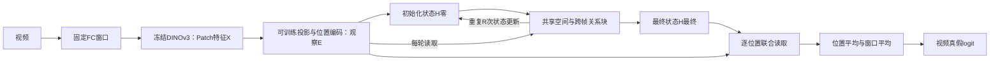

# 当前Looped方案：方法、结果与创新性判断

2026-09-11后续状态：用户已停止Looped训练，本文保留为停止时已有方法与结果的阶段分析，不代表继续执行授权。当前返回[真实参考Local D2研究](REAL_REFERENCE_D2_RESEARCH_PLAN_zh.md)，检查点、预测和可复用Patch均保留。

阶段性核对：2026-09-11。本文依据当前代码和已经验收的seed17三个开发域结果；pooled外部测试及seed29/43尚未完成。本文用于理解和论文讨论，不改变训练配置、模型选择或正在执行的矩阵。实时进度以[自动结果](../results/runs/looped_video/RESULTS_zh.md)为准。

**核心判断：可学习Patch检测头相对旧Global摘要头出现了性能增益；当前结果尚未证明“四轮共享循环＋持续读取原始观察”具有独立优势。两轮共享是一个参数效率候选，但还不是已成立的强创新。**

## 1. 当前研究究竟是什么

我们研究的是：冻结视觉编码器，保留局部Patch特征和位置，用有监督关系头学习真假分类；其中检验共享迭代、观察读取、跨帧交互、循环深度与模型容量的作用。

当前具体实现为：

> 固定视频片段 → 冻结DINOv3 Patch特征 → 可训练投影与位置编码 → 共享时空关系块迭代 → 每位置联合读取原始观察与最终状态 → 视频真假logit。

这是允许使用训练real/fake的**有监督检测器**。Gaussian、CDF、目标域真实统计适配、MoE路由和Local D2公式均不在该检测器内。旧结果不能通过改名算作新方案的消融。

| 术语 | 本文固定含义 | 需要避免的混淆 |
| --- | --- | --- |
| 冻结编码器 | DINOv3参数不更新 | 不等于检测器免训练 |
| 窗口数K | 每视频实际选取的片段数，最多3 | 不等于循环次数 |
| 循环次数R | 一次前向中关系块重复执行的次数 | 不等于训练epoch |
| epoch | 按固定权重抽取一轮训练样本 | 有放回采样，不保证每视频恰好一次 |
| 原始Patch X | 冻结DINO输出的Patch特征 | 不是原始像素，也不是D2 |
| 固定观察E | 本次前向中投影、加位置后的特征 | 投影可训练，只在一次循环前向内固定 |
| 关系状态H | 随循环轮次变化的隐状态 | 不跨视频保留记忆，不是物理状态真值 |
| Average | 每域先对生成器指标等权，再对三域等权 | 不是所有视频混合计算，也不是不足三域时补零 |

十配置只是十个独立实验。它们共用读取的数据，各自维护参数和优化器；不是十专家MoE，也不把十个模型的预测合成一个最终分类器。

## 2. 一条视频实际怎样得到分数

### 2.1 观察与冻结表示

使用已确定的Feature-change最多三个窗口，输入224×224，名义8 FPS；一般窗口16帧，短片段按已冻结的8帧协议处理。掩码排除计算填充，不将重复填帧作为额外真实观察。

每帧DINOv3 ViT-L/16输出14×14个Patch，每个1024维。因此一个16帧窗口的输入为：

\[
X\in\mathbb R^{16\times196\times1024}.
\]

窗口独立进入检测头。不把时间上不连续的FC窗口拼成连续48帧，也不在不同窗口之间执行时空注意力。

### 2.2 固定观察与更新状态

首先计算：

\[
E=P(\operatorname{LN}_{in}(X))+\operatorname{Pos}(t,x,y),\qquad H^{(0)}=E.
\]

默认线性投影P将1024维变成256维，位置使用时间、行、列的固定正弦/余弦编码。LN与P的参数在训练中更新；E只是在该次前向的所有循环内不被覆写。

保留E的设计动机，是让更新后的状态仍能重新访问最初的局部表示。这只保证存在访问路径，不保证分类器实际使用了这条路径，更不保证伪造痕迹一定被保留。

### 2.3 每一轮执行什么

一轮由三个残差更新组成：

\[
Z^{(r)}=H^{(r)}+\gamma_S\odot S_\theta(\operatorname{LN}_S(H^{(r)})),
\]

\[
U^{(r)}=Z^{(r)}+\gamma_C\odot C_\theta(\operatorname{LN}_Q(Z^{(r)}),\operatorname{LN}_E(E)),
\]

\[
H^{(r+1)}=U^{(r)}+\gamma_F\odot\operatorname{FFN}_\theta(\operatorname{LN}_F(U^{(r)})).
\]

S是同帧196个位置之间的空间自注意力。C以当前状态为query，读取E的key/value；读取范围是一个2×2空间组内、窗口的全部有效帧。16帧时每组最多64个观察Token。空间层负责跨空间组交互。

默认4头，每头64维；FFN为256→512→256。三个残差系数是初始化为0.1的可训练通道向量，不是按视频选择专家的路由器。完整模型执行R=4次，所有轮次复用同一套关系块参数；块内部不同子模块并不互相共享权重。

该结构允许跨帧、跨附近位置交互，但没有显式追踪物体，不等于光流、几何对应或物理推理。循环只增加同一批输入上的处理深度，没有观察更多视频。

### 2.4 读出与训练目标

最终每个有效位置连接E和最终状态，经过LN及512→256→1的MLP：

\[
z_{j,t,i}=\operatorname{MLP}([E_{j,t,i},H^{(R)}_{j,t,i}]).
\]

先在每窗口的有效位置取均值，再对窗口等权平均：

\[
a(V)=\frac1{K_{eff}}\sum_j\frac1{T_jN}\sum_{t,i}z_{j,t,i}.
\]

训练标签y=1表示生成视频，使用视频级BCEWithLogits。报告的real方向排序分数为S(V)=-a(V)；另输出sigmoid(a)作为未额外校准的fake概率预测。

只有最终视频真假监督，没有逐Patch伪影标签、关系干预辅助损失、循环收敛监督、跨轮一致性损失或自动停止。局部z不是经过真实伪影定位标注验证的解释图。

## 3. 数据与训练条件

| 开发域 | 片段身份数 | 连接源组数 |
| --- | ---: | ---: |
| ComGenVid | 2694 | 2487 |
| VideoFeedback | 3810 | 3514 |
| GenVideo | 9065 | 8365 |
| 合计 | 15569 | 14366 |

片段身份可能包含同一物理视频的不同长度视图，所以不能都当作独立原视频。真实来源沿既有清单，包括MSVD、MSR-VTT、DiDeMo、Panda70M；具体路径、来源、标签和窗口在当前run的videos.csv、roles.csv、jobs.json中。

三个开发实验分别留出一个数据域：另两个域按源组划分训练和验证，留出域只作测试。每种配置重新训练独立模型。训练保持域、真假和fake生成器均衡，real长度分布匹配fake，源组用途不交叉。

pooled把三个开发域合并后做源级训练/验证，再测试GenVidBench和ViF。其训练池为3034条real片段（2073源组）与9420条fake。新方案没有为外部数据拟合目标Gaussian或CDF。外部现有2216条身份，尚无本轮最终测试结果。

训练固定20epoch、AdamW学习率3e-4、weight decay .01、2epoch预热后余弦调度、有效global batch32。头使用BF16计算，位置/窗口统计平均保持FP32，缓存保留FP32。每配置只依据训练侧验证指标选择最佳epoch，不依据测试结果挑checkpoint。

全部矩阵为10配置×3seed×4种训练范围=120模型。当前只完成seed17三个开发域，即30模型。不能把这一阶段称为完成三seed重复或完成外部确认。

## 4. 十个配置及其作用

| 配置 | R | 宽度 | 参数量 | 回答什么 |
| --- | ---: | ---: | ---: | --- |
| looped | 4 | 256 | 1189121 | 完整候选 |
| untied | 4 | 256 | 3565313 | 相同更新次数，独立参数是否更好 |
| no_refresh | 4 | 256 | 1189121 | 每轮重读原始观察是否必要；最终仍读E |
| spatial_only | 4 | 256 | 1189121 | 跨帧交互是否有用；仍观察全部输入帧 |
| state_only | 4 | 256 | 1189121 | 最终直接读E是否有用；循环仍读E，读出用[H,H]保持参数量 |
| loop1 | 1 | 256 | 1189121 | 一次更新是否已经足够 |
| loop2 | 2 | 256 | 1189121 | 两次共享更新的作用 |
| loop8 | 8 | 256 | 1189121 | 更多迭代是否继续提高 |
| wide512 | 4 | 512 | 4211201 | 容量扩大是否有帮助，8头且每头64维 |
| no_time_position | 4 | 256 | 1189121 | 时间位置是否必要；跨帧读取和空间位置保留 |

参数量仅指可训练检测头，不含冻结DINO。R1/2/4/8是分别训练的模型，不能据此声称一个checkpoint已经支持任意推理深度。当前untied是本实现的非共享对照，不是EA-Swin官方完整复现。

## 5. 当前效果：整体有增益，循环增益尚不明确

下表全部为seed17，AUC/AP-real；每域按其生成器单元等权，Average为三域等权。显示3位小数，精确数据见method_review/metrics.csv。

| 方法 | ComGenVid | VideoFeedback | GenVideo | Average |
| --- | ---: | ---: | ---: | ---: |
| 旧Global均匀双头 | 0.969/0.970 | 0.964/0.965 | 0.972/0.968 | 0.968/0.968 |
| 完整四轮looped | 0.974/0.973 | 0.972/0.971 | 0.972/0.964 | 0.973/0.969 |
| 非共享untied | 0.981/0.982 | 0.973/0.973 | 0.972/0.966 | **0.975**/0.973 |
| no_refresh | 0.982/0.980 | 0.970/0.969 | 0.970/0.963 | 0.974/0.971 |
| spatial_only | 0.982/0.980 | 0.969/0.966 | 0.971/0.964 | 0.974/0.970 |
| state_only | 0.981/0.980 | 0.968/0.968 | 0.971/0.965 | 0.973/0.971 |
| loop1 | 0.980/0.979 | 0.969/0.969 | 0.972/0.966 | 0.974/0.971 |
| loop2 | 0.981/0.981 | 0.971/0.972 | 0.972/0.964 | 0.975/0.973 |
| loop8 | 0.975/0.972 | 0.971/0.969 | 0.971/0.964 | 0.972/0.968 |
| wide512 | 0.980/0.981 | 0.971/0.971 | 0.975/0.970 | 0.975/**0.974** |
| no_time_position | 0.978/0.977 | 0.971/0.968 | 0.969/0.962 | 0.973/0.969 |

加粗按未四舍五入点估计判断：untied的Average AUC=0.975412，wide512的Average AP-real=0.973699；不表示已确认优于所有候选。完整looped为0.972767/0.969435；loop2为0.974808/0.972580。

旧Global对照也是冻结DINO的监督头，使用同一源级划分和测试身份。本次使用其seed17结果0.968267/0.967738，而不是拿旧三seed均值直接对比。旧头约26.2万参数，训练30epoch；当前头输入、容量、学习率、正则、窗口分数聚合和训练日程也不同。因此这是整体方案比较，不是只改变循环的因果实验。旧real-only方法约0.88的结果不混入此表。

### 5.1 新补算的三域配对区间

同一源组在模型间共享重抽样权重，1000次Poisson bootstrap；固定seed17和已拟合模型。区间未校正全部开发搜索和多重比较，不包含换训练seed造成的波动。

| 对比（前者减后者） | ΔAverage AUC [95%CI] | ΔAverage AP-real [95%CI] |
| --- | ---: | ---: |
| 完整looped − 旧Global | +0.004500 [+0.000540,+0.008973] | +0.001697 [−0.001873,+0.005572] |
| untied − 旧Global | +0.007145 [+0.003309,+0.011675] | +0.005579 [+0.002427,+0.009409] |
| loop2 − 旧Global | +0.006541 [+0.002663,+0.010862] | +0.004842 [+0.001398,+0.008624] |
| wide512 − 旧Global | +0.006991 [+0.003083,+0.011877] | +0.005961 [+0.002506,+0.009806] |
| 完整looped − untied | −0.002645 [−0.004423,−0.000886] | −0.003882 [−0.005850,−0.001958] |
| 完整looped − loop2 | −0.002041 [−0.003708,−0.000188] | −0.003145 [−0.004981,−0.001165] |
| loop2 − loop1 | +0.001203 [−0.000047,+0.002547] | +0.001461 [−0.000019,+0.002974] |
| loop2 − untied | −0.000605 [−0.002369,+0.001022] | −0.000737 [−0.002314,+0.000694] |

现在可以说：完整模型对旧Global的Average AUC已有该条件下的正区间，但AP仍不确定；两个单域区间跨零与三域Average区间为正并不矛盾。更强的正信号也出现在非共享和两轮版本，不能全部归功于四轮循环。

### 5.2 结果对原设计分别意味着什么

**循环深度：** R1/2/4/8的Average AUC分别为0.973605/0.974808/0.972767/0.971965。当前没有随循环次数增加而持续提高；R2相对R1的区间仍跨零，不能写成“两轮已经证明优于一次”。

**参数共享：** R4共享落后于四层非共享，配对AUC/AP区间均在零以下。R2与非共享点估计接近，参数仅约三分之一，具有候选参数效率价值；“差异区间跨零”并不等于已经证明等效或非劣。

**持续读取观察：** 去掉持续重读后的Average点估计反而略高，差值区间跨零。ComGenVid与VideoFeedback的作用方向不同，当前不支持把持续重读作为稳定增益模块。

**时间顺序：** 去掉时间位置后Average AUC=0.972808，与完整模型0.972767几乎相同。该模型仍能比较多个帧，也继承固定选窗；不能说完全没有时间信息。但当前证据没有显示显式帧序是增益的必要来源，更不能宣称有序物理动态推理已成立。

**空间与时序：** 仅空间模型在ComGenVid更好，完整模型在VideoFeedback更好；三域Average上完整模型没有稳定超过仅空间模型。收益可能来自更丰富的局部外观及跨帧集合关系，具体归因仍需克制。

**GenVideo边界：** 完整looped的AUC基本与旧Global持平，AP从0.968171降到0.964326。当前不能写成各域全面提高。wide512在该域点估计更高，可能存在容量作用，但不能凭这一行宣称已定位唯一原因。

## 6. 哪些结构已有先例，哪些价值仍待我们证明

| 当前组成 | 直接相关先例 | 对原创性表述的约束 |
| --- | --- | --- |
| 冻结Patch编码器＋时空Transformer检测头 | [EA-Swin](https://arxiv.org/html/2602.17260v1) | 已有直接视频检测先例，包括DINOv3实验；我们的untied不能替代对其原生方法的核对 |
| Transformer跨深度共享与迭代更新 | [Universal Transformers](https://arxiv.org/abs/1807.03819) | 循环和参数共享不是新数学工具 |
| 状态反复读取固定输入 | [Perceiver](https://proceedings.mlr.press/v139/jaegle21a.html) | 不可覆写观察和重复交叉注意力不是首次出现 |
| 视觉关系任务中的共享迭代 | [Déjà View](https://arxiv.org/html/2605.30215v1) | 支持视觉共享更新的可行性；它研究多视图重建，不证明视频真假分类会获益 |

因此，“冻结DINO＋时空注意力＋循环＋原始输入旁路”作为组件清单，原创性有限。当前没有实现新的伪影监督、专门的关系干预训练、经过验证的迭代纠错目标或可变深度训练，不能把最初建议中的这些内容写成已完成的方法。

## 7. 创新性判断：有研究问题，尚无足够强的机制结论

| 想表达的主张 | 当前证据状态 |
| --- | --- |
| 新Patch学习方案能改善旧Global摘要基线 | seed17三域有正面证据，尤其AUC；仍混有输入/容量/训练日程变化 |
| 四轮共享比独立堆叠更有效 | 当前结果反对这一具体主张 |
| 更多循环带来更强推理 | 当前不支持；深度曲线非单调 |
| 持续重读原始观察可稳定保护伪影 | 没有稳定独立增益或真实伪影定位证据 |
| 时间顺序是有效性的关键 | 当前不支持，移除时间位置几乎不改变Average |
| 两轮共享能以较少头参数接近非共享模型 | 点估计和参数计数支持候选方向，多seed/外部/非劣与真实成本尚待确认 |
| 十模型共用读取提高实验效率 | 已实现的工程优化，不是检测器内的MoE创新 |
| 跨生成器泛化已经解决 | 缺少本轮外部结果；LODO也不自动等于生成器家族完全未见 |

**以目前实现和已完成证据，不能把这套组合直接视为已经足够扎实的ICLR主方法创新。**问题不只是涨点幅度，而是结构有直接先例，且预定循环机制的关键消融尚未给出稳定支持。

这不等于方法无效。当前比较适合的定位是“冻结Patch表示上的参数共享关系检测器及其受控研究”。若后续证据支持两轮在外部保持性能、比一次更新稳定更好，并以较少参数/实际计算接近或超过非共享头，参数效率主线才更扎实。只减少检测头参数，不等于完整含DINO系统缩小三倍。

## 8. 接下来怎样收敛

先完成已冻结的seed17外部测试和另外两个seed，不在当前阶段再次加入更多模块或根据测试域切换模型。

优先判断三个问题：两轮是否稳定优于一轮；共享是否比相同计算的非共享更可迁移；重读/时间顺序是否在外部具有独立价值。如果这些问题没有正证据，就缩小循环与时序推理的表述，不通过改名维持原贡献列表。

现有比较还缺少“同Patch输入的简单池化头”及真正同协议的直接先行方法比较。旧Global摘要MLP输入不同，不能独自排除“只是Patch输入更丰富或分类头更大”的解释。若后续进入论文完善，这两项比继续开新模块更有诊断价值；本文不自动启动它们。

即使训练侧验证接近0.99，也不能替代留域或外部结果。对ViF等困难域的结论、三seed波动和已见数据上的开发选择，需要在最终论文中公开。

## 9. 证据入口与写作组织

本文按“实际方法→公平结果→组件归因→已有工作→创新边界”组织，避免先提出宏大的循环推理结论再寻找支持。

- [模型实现](../src/looped_video/model.py)、[配置](../configs/looped_video.yaml)、[训练与自动流程](LOOPED_VIDEO_PLAN_zh.md)。
- [自动总表](../results/runs/looped_video/RESULTS_zh.md)、[三域Average全精度](../results/runs/looped_video/average_summary.csv)。
- [本次对照指标](../results/runs/looped_video/method_review/metrics.csv)、[配对区间](../results/runs/looped_video/method_review/paired_intervals.csv)、[输入/输出hash](../results/runs/looped_video/method_review/manifest.json)。
- [对照计算脚本](../scripts/summarize_looped_evidence.py)：固定seed17三域，不改变训练，也不自动按结果选配置。

缺失证据明确为：本轮外部测试、三seed完整重复、同Patch简单头、直接竞争方法的匹配比较、有效循环关系的机制检验。以上缺口不由训练loss、工程测试通过或参数量更少自动补足。
