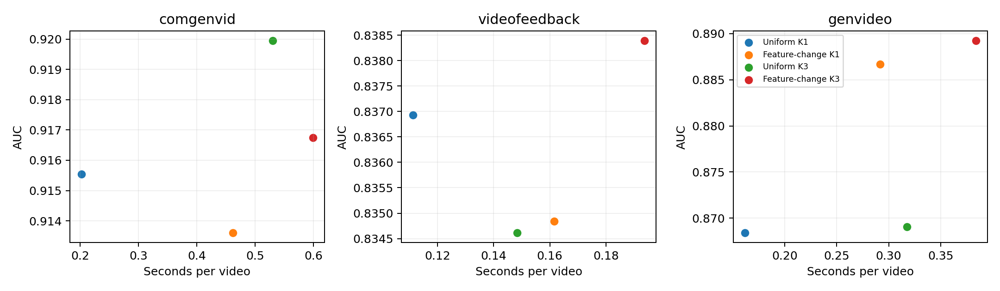

# 论文前五组实验结果

本轮使用当前主线重新拟合与评分。主方法：目标Global＋Local归一化D2，Feature-change K3，0.5/0.5。
开发评分池21421视频；主表固定20个数据集—生成器单元、13033唯一视频、20870配对行。Macro先域内生成器等权，再三域等权。AP指AP-real，AP-fake另列。
目标拟合每域200片段；ComGenVid为132源组，其余两域各200源组。同预算外部统计使用独立VATEX200；CDF为另一批2000，阈值再独立2000。
所有区间条件于固定参考，采用1000次源组配对Poisson bootstrap，未作多重比较校正。独立阈值迁移不保证目标域名义误报率。

## 1. 主实验

| 方法 | Macro AUC | AP-real |
| --- | ---: | ---: |
| 原版STALL单窗 | 0.840248 | 0.844552 |
| 官方Global＋FC3 | 0.852900 | 0.854311 |
| 目标Global＋FC3 | 0.872422 | 0.876222 |
| 完整主线 | 0.881462 | 0.882444 |

逐域见`main.csv`；全部20单元见`main_generators.csv`。

## 2. 组件消融

| 方法 | Macro AUC | AP-real |
| --- | ---: | ---: |
| 完整主线 | 0.881462 | 0.882444 |
| 去Local | 0.872422 | 0.876222 |
| 去Global | 0.845758 | 0.843662 |
| 去Global空间 | 0.872380 | 0.869836 |
| 去Global时序 | 0.875545 | 0.881204 |

逐域见`components.csv`；全部20单元见`components_generators.csv`。

## 3. 表示消融

| 方法 | Macro AUC | AP-real |
| --- | ---: | ---: |
| Local归一化D1 | 0.876485 | 0.875981 |
| Local归一化D2 | 0.881462 | 0.882444 |
| Local未归一化D2 | 0.633771 | 0.707951 |
| Local D2幅度 | 0.670316 | 0.703889 |
| Global归一化D2 | 0.855274 | 0.855261 |

逐域见`representation.csv`；全部20单元见`representation_generators.csv`。

## 3.1 Local单分支

| 方法 | Macro AUC | AP-real |
| --- | ---: | ---: |
| Local D1（原始分数） | 0.834220 | 0.828349 |
| Local D1（视频CDF后） | 0.834312 | 0.829089 |
| Local D2（原始分数） | 0.845465 | 0.842880 |
| Local D2（视频CDF后） | 0.845758 | 0.843662 |
| 未归一化D2（原始分数） | 0.301447 | 0.411218 |
| 未归一化D2（视频CDF后） | 0.300256 | 0.410924 |
| D2幅度（原始分数） | 0.339066 | 0.421443 |
| D2幅度（视频CDF后） | 0.337952 | 0.421028 |
| Global D2（原始分数） | 0.825171 | 0.819882 |
| Global D2（视频CDF后） | 0.824651 | 0.819985 |

逐域见`representation_local.csv`；全部20单元见`representation_local_generators.csv`。

## 4.1 参考来源四格

| 方法 | Macro AUC | AP-real |
| --- | ---: | ---: |
| Global源／Local源 | 0.853962 | 0.850651 |
| Global源／Local目标 | 0.876073 | 0.874291 |
| Global目标／Local源 | 0.880766 | 0.879346 |
| Global目标／Local目标 | 0.881462 | 0.882444 |

逐域见`reference_sources.csv`；全部20单元见`reference_sources_generators.csv`。

## 4.2 Local均值与白化

| 方法 | Macro AUC | AP-real |
| --- | ---: | ---: |
| 源均值／源白化 | 0.880766 | 0.879346 |
| 目标均值／源白化 | 0.880770 | 0.879353 |
| 源均值／目标白化 | 0.881492 | 0.882458 |
| 目标均值／目标完整白化 | 0.881462 | 0.882444 |
| 目标对角白化 | 0.869914 | 0.871640 |

逐域见`local_metric.csv`；全部20单元见`local_metric_generators.csv`。

## 5. 观察预算

| 方法 | Macro AUC | AP-real |
| --- | ---: | ---: |
| Uniform K1 | 0.873625 | 0.877699 |
| Feature-change K1 | 0.878374 | 0.878892 |
| Uniform K3 | 0.874540 | 0.875159 |
| Feature-change K3 | 0.881462 | 0.882444 |

逐域见`observation.csv`；全部20单元见`observation_generators.csv`。

## 解释边界

主比较相对官方STALL的差异同时包含观察预算和目标真实数据适配；Local独立作用看同目标预算Global-only控制。
源／目标Global×Local四格存在交互，不能把两项收益直接相加；均值／白化交换是在固定目标Global下的Local控制。
Global D2与Local每视频拟合向量数不同：Global D2使用所有有效时间差分，Local固定256；它们共享视频与观察窗口预算。
官方对照使用官方固定随机2秒窗与NumPy评分，工程前向统一batch8。当前Global窗口CDF仍为VATEX Uniform首窗；观察消融只给Local建立匹配视频CDF。
成本使用实际单模型评分器，无特征缓存，每选择器预热后测两遍；OS页缓存不受控，不能把第一遍叫严格冷磁盘。GPU峰值与进程RSS口径见各runtime manifest。
成本子集包含ComGenVid 6、VideoFeedback 24、GenVideo 18条视频，各策略各测两遍，共384次计时；这些不是全量数据集的平均运行时间。成本测试的384次分数均与相应全量分数一致。
图中横轴来自上述固定成本子集，纵轴为全量配对AUC；各面板纵轴范围不同。
官方NumPy评分已与上游提交`bfcc603ae83b4e609681277b9b5e80e7a9497e15`在18个相同特征窗口上逐元素核对一致；这不意味着工程batch8与上游默认batch32前向逐元素相同。
不按数据域切换方法；VideoFeedback等不利结果完整保留。数据已用于开发，不称未接触确认集。

完整差值区间见`confidence_intervals.csv`；独立阈值见`operating_points.csv`；成本见`runtime_summary.csv`及`runtime_videos.csv`；新旧分数核对见`reproduction.csv`。

